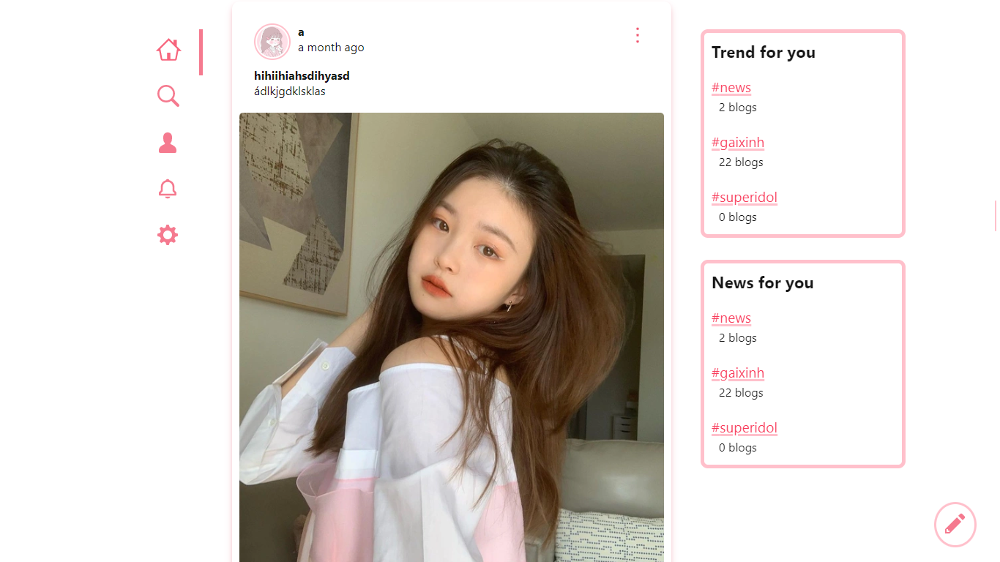
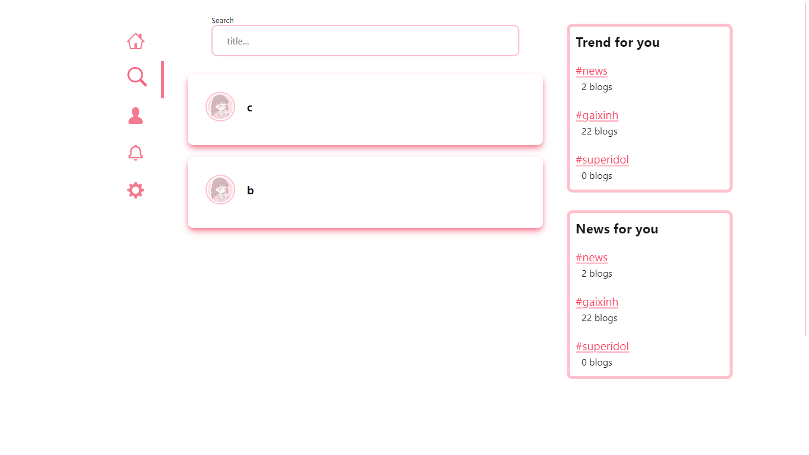
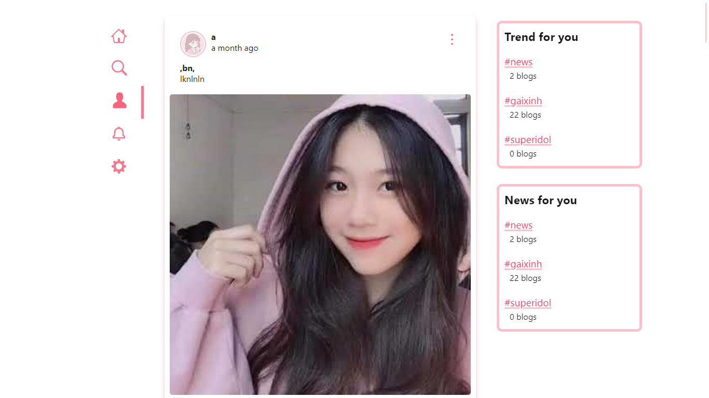
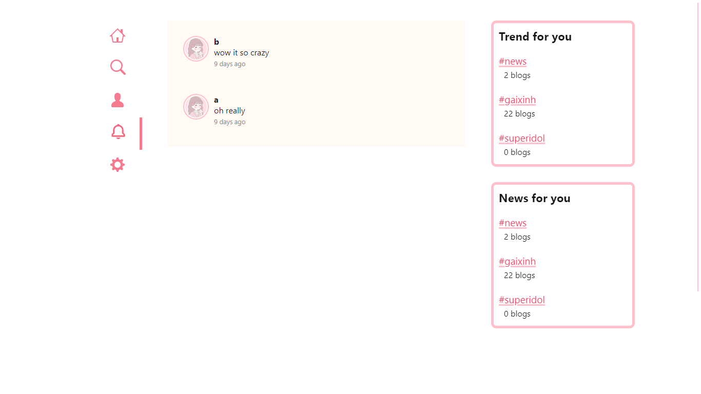
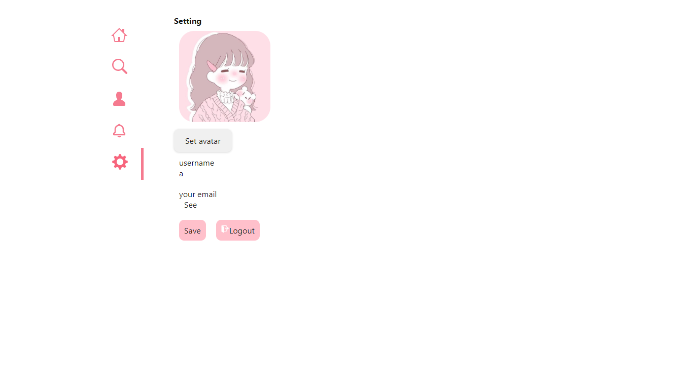

# Social Media App

- Where you can share your image or status for every one

##### Home page



##### Search page



##### Your page



##### Notification page



##### Setting page



## Live demo

### [Live Demo](https://social-media-v1.netlify.app/)

## Installation Steps

### Using npm

Run server

1. `cd ./server`

2. `npm install`

3. `npm run dev`

Run client

1. `cd ./client`

2. `npm install`

3. `npm start`

## Environment variables

1. Open folder `./server` to create `.env` file.

2. Open a `.env` file then edit add this setting

```
USERNAME_DB=youruserDB
PASSWORD_DB=yourpasswordDB
SECRET_TOKEN=somethingyouwant
API=http://localhost:4000
APISERVER=http://localhost:3000
```

## Contributing

Pull requests are welcome. For major changes, please open an issue first to discuss what you would like to change.

Please make sure to update tests as appropriate.

> Special thanks [shidomnt](https://github.com/shidomnt).
